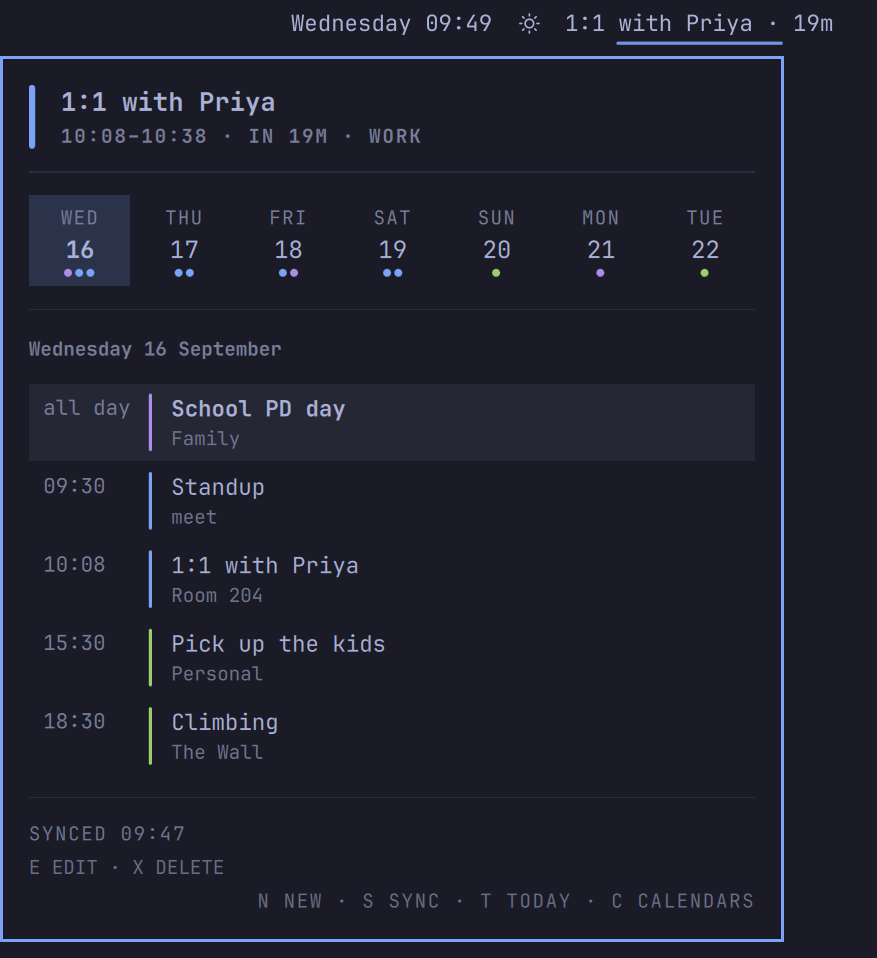

# Omagenda

*Type a sentence, get an event. What's next, always in the bar.*

**v0.2.1 candidate:** See [changes and known limitations](CHANGELOG.md).

**Reviewer preview:** Google access currently requires an approved test user;
sign-in expires after seven days in Testing mode. See
[reviewer checks and limitations](docs/reviewer-checklist.md) before connecting calendars.

An [Omarchy](https://omarchy.org) shell plugin that brings the two ideas
that made Fantastical's original menu-bar app worth having — a small
agenda you can summon, and event entry by typing a sentence — to the
Omarchy desktop. Events are plain `.ics` files in a vdir you own.



Quick Add parses as you type and previews the event before you save.
Its native text field supports cursor movement, selection, undo and paste.

It takes its colours from your theme, because it reads the theme's own
palette rather than shipping one.

## Install

```bash
omarchy pkg add python-icalendar python-dateutil python-recurring-ical-events inotify-tools libsecret
omarchy plugin add https://github.com/fixedsupply/omagenda.git --enable --yes
```

The pill and panel can open at this point; events appear after a calendar is connected.
A plugin's `bin/` is not added to your PATH automatically; link the CLI once:

```bash
mkdir -p ~/.local/bin
ln -sf ~/.config/omarchy/plugins/fixedsupply.omagenda/bin/omagenda ~/.local/bin/omagenda
```

Check that `omarchy plugin list | grep omagenda` shows Omagenda enabled and
`omagenda --version` shows `0.2.1` from
`~/.config/omarchy/plugins/fixedsupply.omagenda` (resolved if it is a symlink).
After connecting a calendar, `omagenda doctor` should be clean.

Then connect a calendar — Google, iCloud, any CalDAV server, or a
read-only `.ics` subscription:

```bash
omagenda account add google
```

and check it landed:

```bash
omagenda doctor
```

Full recipes for each account type are in
[docs/sync-setup.md](docs/sync-setup.md).

## Upgrading

For an install made with `omarchy plugin add`:

```bash
omarchy plugin update fixedsupply.omagenda
omarchy restart shell
```

If a development checkout or a failed install already occupies the plugin
folder, `omarchy plugin add` refuses with “plugin id … is already used”.
Remove that folder or symlink, with no trailing slash, then reinstall and
relink the CLI:

```bash
rm -rf -- ~/.config/omarchy/plugins/fixedsupply.omagenda
omarchy plugin add https://github.com/fixedsupply/omagenda.git --enable --yes
ln -sf ~/.config/omarchy/plugins/fixedsupply.omagenda/bin/omagenda ~/.local/bin/omagenda
omarchy restart shell
```

Removing a symlink this way leaves its checkout intact. If the path is a
real folder containing development changes, save those changes first.
Check `omarchy plugin list | grep omagenda`, `omagenda --version` and
`omagenda doctor` again. Doctor identifies a stale CLI on PATH and reports
a failure when any check needs attention, including with `--json`.

## Account maintenance

Reconnect an existing account with `omagenda account add <type> --id <id>`.
Its calendar selection and other saved settings are preserved. Adding a
second login of the same type requires a new explicit `--id`; leaving it
out prints the existing accounts' reconnect commands before sign-in.

Account removal with `omagenda account remove <id>` deletes local credentials
and configuration only; local calendar files remain. For Google, use
`omagenda account remove <id> --revoke` instead to revoke access everywhere.
Revoking signs Omagenda out on every computer using that Google account.
After local removal, revoke access through https://myaccount.google.com/permissions.

## Keybindings

Omagenda ships none, because a plugin should not take your keys without
asking. Add the contents of [docs/bindings.lua](docs/bindings.lua) to
`~/.config/hypr/bindings.lua` for:

| Keys | Does |
|---|---|
| `SUPER + CTRL + N` | Quick Add |
| `SUPER + CTRL + ALT + N` | The agenda panel |

`SUPER + CTRL + ALT + D` is the stock clock's calendar and is left alone.

There are menu entries too, in
[docs/omarchy-menu.jsonc](docs/omarchy-menu.jsonc).

## The pill

Sits beside the clock rather than replacing it. It shows what is running
now, or what starts within the next half hour, with a countdown. The rest
of the time it is a calendar icon — still there, still one click from the
agenda.

- **Click** opens the agenda panel.
- **Right-click** syncs immediately.

`Always show the next event` in the settings keeps the full text up
regardless; `Hide the pill completely when nothing is coming up` gives
back the space instead. Both are in the bar widget's settings, along with
the lead time, the countdown, how many days the ticker covers, and 12-
versus 24-hour time.

## Panel keys

Use `j`/`k` or Up/Down to select an event, and `h`/`l` or Left/Right to change day.

| Key | Action |
| --- | --- |
| `e` | Edit the selected event through a pre-filled Quick Add sentence. |
| `x` | Arm deletion; press `x` again to confirm. `Esc` cancels. Read-only and recurring events cannot be deleted here. |
| `o` | Open the selected event's meeting link, URL or web location, when present. |
| `c` | Show or hide the calendar pick list. |
| `n` | Quick Add on the selected day. |
| `s` | Sync. |
| `t` | Return to today. |
| `Enter` | Expand or collapse event details; toggle the selected calendar in the pick list. |
| `Esc` | Cancel pending deletion, leave the pick list, or close the panel, in that order. |
| `Tab` / `Shift+Tab` | Switch to the next / previous shell panel. |

Moving the selection, changing day, opening the calendar list or Quick Add,
or closing the panel also cancels deletion. The footer shows available event actions.

## Quick Add

Type the event the way you would say it:

```
lunch with Sam tomorrow at 1pm at Cafe Torino
standup every weekday at 9:30
dentist on 14/9 at 10am for 45m
review 2-3pm /work
Coffee 10am tomorrow
appointment on Sep 14 2027 at 10am
```

The line underneath previews the date, time and title that will be written. Ambiguous times such as "at 3" produce a warning. The preview lets you
check the interpretation before saving.

- `Enter` saves. `Shift + Enter` saves and stays open for the next one.
- `Tab` cycles which calendar it goes to, among those that can accept an
  event.
- A `/tag` in the sentence names a calendar directly.
- `Esc` cancels without saving.

Press `e` on an event to edit its sentence. `Enter` updates that same event;
`Esc` cancels. The destination says `(editing)`, and Tab and Shift+Enter are
disabled. Normal Quick Add starts empty in add mode afterwards.

Editing refuses read-only calendars, recurring events, events with guests,
multiple-event files, conflict files and unsafe paths. If the title, dates or
location cannot round-trip through the parser, the panel explains why it
cannot open the event. One-day all-day events are supported; multi-day all-day
events cannot currently be described. Explicit years allow editing past dates.

Previous versions are saved privately before replacement at
`$OMAGENDA_STATE/edited/<sanitised-calendar-id>/<stem>.<UTC-timestamp>.ics`
(default state directory: `~/.local/state/omagenda`). The watcher syncs updates;
editing does not start a sync.

## The CLI

```bash
omagenda describe /path/from/agenda/event.ics --json
omagenda edit /path/from/agenda/event.ics "Dentist on Sep 17 at 3pm for 1h at Main St Clinic" --dry-run --json
```

Remove `--dry-run` to save. An unchanged sentence writes nothing. Edit keeps
the event's calendar and metadata; calendar moves and changes to recurrence
or alerts are refused. Changed times use the local timezone.

The panel uses the same CLI. Data commands support `--json`; interactive
`account add`, the long-running `watch`, and the internal `resolve-conflict`
helper do not. Use `omagenda --help` or a subcommand's `--help` for flags.

```bash
omagenda agenda --days 3          # what the panel shows
omagenda next                     # what the pill shows
omagenda parse "lunch tomorrow 1pm"   # interpret, write nothing
omagenda add "lunch tomorrow 1pm"
omagenda delete /path/from/agenda/event.ics --json
omagenda calendars                # ids, colours, which are read-only
omagenda calendars --set-default work
omagenda sync
omagenda doctor
```

`delete` takes the exact `file` path from `agenda --json`. It refuses read-only
calendars, recurrence, files with multiple events, conflict files and unsafe paths.
The CLI deletes immediately; the panel asks for a second `x` first. Before removal,
a private safety copy is saved at
`$OMAGENDA_STATE/deleted/<sanitised-calendar-id>/<original-stem>.<UTC-timestamp>.ics`
(default state: `~/.local/state/omagenda`). The agenda refreshes immediately;
the normal watcher sync sends the deletion to the provider.

To restore, copy the saved file back into its calendar folder under its original
name. The next sync uploads it again.

There is a Claude Code skill in [skill/SKILL.md](skill/SKILL.md); copy it
to `~/.claude/skills/omagenda` and an agent session can answer "what's on
Thursday" and add events the same way the panel does.

## How it works

`~/.local/share/calendars` is the truth. One `.ics` file per event, in
the conventional [vdir](https://vdirsyncer.pimutils.org/en/stable/vdir.html)
layout, alongside `displayname` and `color`. The pill, the panel, Quick
Add, the CLI, and anything else that speaks vdir — `khal`, for instance —
share that event directory. Configuration, credentials and sync state live separately.

A background watcher reindexes when a file changes and syncs every five
minutes, and within about ten seconds of a change you make. Google syncs
through a built-in bridge; iCloud and other CalDAV servers sync through
[pimsync](https://pimsync.whynothugo.nl/), configured for you by
`omagenda account add`.

OAuth tokens and app passwords use the system keyring when available.
If it is unavailable, they fall back to a private file with owner-only
permissions under `~/.local/state/omagenda/secrets`. Subscription URLs are
credentials too: keep your local configuration private.

## Works alongside renCal and OmaCal

Omagenda is not a calendar window and does not want to be one. If you use
renCal or OmaCal for the month grid,
keep them — Omagenda adds the bar pill, the hotkey, and the sentence,
which is the part none of them do. When `omacal` is on your `PATH`,
Omagenda reads its events too.

## Requirements

Omarchy 4.0.x, and the Python packages in the install line above.

`inotify-tools` is optional but worth having. Without it the watcher
cannot tell a file change from a timer tick, so an event you add reaches
the server on the next five-minute sync instead of within seconds.

iCloud and CalDAV also require `pimsync`; see the sync setup guide.
Run `omagenda doctor` if anything looks wrong. On an empty install, no
calendars and no previous sync are expected; connect an account and sync.
Doctor reads the last sync result, so it does not test sign-in over the network.

## Not affiliated with Flexibits

Fantastical is a Flexibits product and the name is theirs. It is
mentioned here once, descriptively, to say where the idea came from.
Omagenda is an independent project, contains no Flexibits code, icons, or
assets, and is not endorsed by them.

[Homepage](https://fixedsupply.dev/omagenda/) ·
[Privacy](https://fixedsupply.dev/omagenda/privacy/) ·
[Terms](https://fixedsupply.dev/omagenda/terms/)

## License

MIT. See [LICENSE](LICENSE).

## Calendar visibility

Press `c` in the panel to choose calendars. Use `j`/`k` or arrows to move,
`Space`/`Enter` or a click to toggle, and `c`/`Escape` to return.
Hidden calendars keep syncing but disappear from the agenda, pill and alarms.
Quick Add's Tab cycle skips them; a hidden default still receives new events
and is marked `(hidden)` in the destination line.

`omagenda calendars --hide ID`, `--show ID` (repeatable), and `--show-all`
save visibility in the top-level `hidden_calendars` config preference.
`omagenda calendars --json` includes hidden flags and the saved ids.
