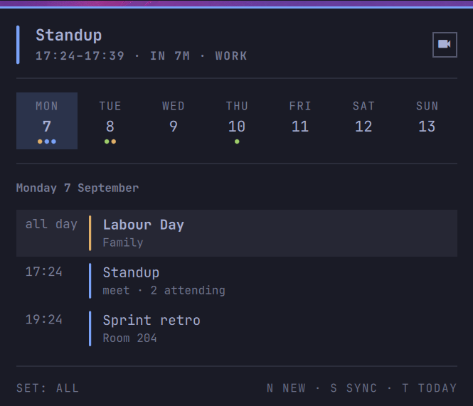

# Omagenda

*Type a sentence, get an event. What's next, always in the bar.*

**Reviewer preview:** Google access currently requires an approved test user;
sign-in expires after seven days in Testing mode. See
[reviewer checks and limitations](docs/reviewer-checklist.md) before connecting calendars.

An [Omarchy](https://omarchy.org) shell plugin that brings the two ideas
that made Fantastical's original menu-bar app worth having — a small
agenda you can summon, and event entry by typing a sentence — to the
Omarchy desktop. Events are plain `.ics` files in a vdir you own.


Quick Add parses as you type and previews the event before you save.
Its native text field supports cursor movement, selection, undo and paste.

It takes its colours from your theme, because it reads the theme's own
palette rather than shipping one:



## Install

```bash
omarchy pkg add python-icalendar python-dateutil python-recurring-ical-events inotify-tools
omarchy plugin add https://github.com/fixedsupply/omagenda.git --enable --yes
```

The pill and the panel work at this point. The `omagenda` command does
not yet, because nothing puts a plugin's `bin/` on your path; link it
once:

```bash
ln -sf ~/.config/omarchy/plugins/fixedsupply.omagenda/bin/omagenda ~/.local/bin/omagenda
```

Then connect a calendar — Google, iCloud, any CalDAV server, or a
read-only `.ics` subscription:

```bash
omagenda account add google
```

and check it landed:

```bash
omagenda doctor
```

Full recipes for each account type are in
[docs/sync-setup.md](docs/sync-setup.md).

## Keybindings

Omagenda ships none, because a plugin should not take your keys without
asking. Add the contents of [docs/bindings.lua](docs/bindings.lua) to
`~/.config/hypr/bindings.lua` for:

| Keys | Does |
|---|---|
| `SUPER + CTRL + N` | Quick Add |
| `SUPER + CTRL + ALT + N` | The agenda panel |

`SUPER + CTRL + ALT + D` is the stock clock's calendar and is left alone.

There are menu entries too, in
[docs/omarchy-menu.jsonc](docs/omarchy-menu.jsonc).

## The pill

Sits beside the clock rather than replacing it. It shows what is running
now, or what starts within the next half hour, with a countdown. The rest
of the time it is a calendar icon — still there, still one click from the
agenda.

- **Click** opens the agenda panel.
- **Right-click** syncs immediately.

`Always show the next event` in the settings keeps the full text up
regardless; `Hide the pill completely when nothing is coming up` gives
back the space instead. Both are in the bar widget's settings, along with
the lead time, the countdown, how many days the ticker covers, and 12-
versus 24-hour time.

## Panel keys

Use `j`/`k` or Up/Down to select an event, and `h`/`l` or Left/Right to change day.

| Key | Action |
| --- | --- |
| `e` | Edit the selected event's raw `.ics` file in the editor (writable calendars). |
| `x` | Arm deletion; press `x` again to confirm. `Esc` cancels. Read-only and recurring events cannot be deleted here. |
| `o` | Open the selected event's meeting link, URL or web location, when present. |
| `c` | Show or hide the calendar pick list. |
| `n` | Quick Add on the selected day. |
| `s` | Sync. |
| `t` | Return to today. |

Moving the selection, changing day, opening the calendar list or Quick Add,
or closing the panel also cancels deletion. The footer shows available event actions.

## Quick Add

Type the event the way you would say it:

```
lunch with Sam tomorrow at 1pm at Cafe Torino
standup every weekday at 9:30
dentist on 14/9 at 10am for 45m
review 2-3pm /work
```

The line underneath previews the date, time and title that will be written. Ambiguous times such as "at 3" produce a warning. The preview lets you
check the interpretation before saving.

- `Enter` saves. `Shift + Enter` saves and stays open for the next one.
- `Tab` cycles which calendar it goes to, among those that can accept an
  event.
- A `/tag` in the sentence names a calendar directly.

## The CLI

Everything the panel does, `omagenda` does, and every command takes
`--json`.

```bash
omagenda agenda --days 3          # what the panel shows
omagenda next                     # what the pill shows
omagenda parse "lunch tomorrow 1pm"   # interpret, write nothing
omagenda add "lunch tomorrow 1pm"
omagenda delete /path/from/agenda/event.ics --json
omagenda calendars                # ids, colours, which are read-only
omagenda calendars --set-default work
omagenda sync
omagenda doctor
```

`delete` takes the exact `file` path from `agenda --json`. It refuses read-only
calendars, recurrence, files with multiple events, conflict files and unsafe paths.
The CLI deletes immediately; the panel asks for a second `x` first. Before removal,
a private safety copy is saved at
`$OMAGENDA_STATE/deleted/<sanitised-calendar-id>/<original-stem>.<UTC-timestamp>.ics`
(default state: `~/.local/state/omagenda`). The agenda refreshes immediately;
the normal watcher sync sends the deletion to the provider.

To restore, copy the saved file back into its calendar folder under its original
name. The next sync uploads it again.

There is a Claude Code skill in [skill/SKILL.md](skill/SKILL.md); copy it
to `~/.claude/skills/omagenda` and an agent session can answer "what's on
Thursday" and add events the same way the panel does.

## How it works

`~/.local/share/calendars` is the truth. One `.ics` file per event, in
the conventional [vdir](https://vdirsyncer.pimutils.org/en/stable/vdir.html)
layout, alongside `displayname` and `color`. The pill, the panel, Quick
Add, the CLI, and anything else that speaks vdir — `khal`, for instance —
all read and write that directory and nothing else.

A background watcher reindexes when a file changes and syncs every five
minutes, and within about ten seconds of a change you make. Google syncs
through a built-in bridge; iCloud and other CalDAV servers sync through
[pimsync](https://pimsync.whynothugo.nl/), configured for you by
`omagenda account add`.

OAuth tokens and app passwords use the system keyring when available.
If it is unavailable, they fall back to a private file with owner-only
permissions under `~/.local/state/omagenda/secrets`. Subscription URLs are
credentials too: keep your local configuration private.

## Works alongside renCal and OmaCal

Omagenda is not a calendar window and does not want to be one. If you use
renCal or OmaCal for the month grid,
keep them — Omagenda adds the bar pill, the hotkey, and the sentence,
which is the part none of them do. When `omacal` is on your `PATH`,
Omagenda reads its events too.

## Requirements

Omarchy 4.0.x, and the Python packages in the install line above.

`inotify-tools` is optional but worth having. Without it the watcher
cannot tell a file change from a timer tick, so an event you add reaches
the server on the next five-minute sync instead of within seconds.

Run `omagenda doctor` if anything looks wrong; it names what is missing
and the command that fixes it.

## Not affiliated with Flexibits

Fantastical is a Flexibits product and the name is theirs. It is
mentioned here once, descriptively, to say where the idea came from.
Omagenda is an independent project, contains no Flexibits code, icons, or
assets, and is not endorsed by them.

## License

MIT. See [LICENSE](LICENSE).

## Calendar visibility

Press `c` in the panel to choose calendars. Use `j`/`k` or arrows to move,
`Space`/`Enter` or a click to toggle, and `c`/`Escape` to return.
Hidden calendars keep syncing but disappear from the agenda, pill and alarms.
Quick Add's Tab cycle skips them; a hidden default still receives new events
and is marked `(hidden)` in the destination line.

`omagenda calendars --hide ID`, `--show ID` (repeatable), and `--show-all`
save visibility in the top-level `hidden_calendars` config preference.
`omagenda calendars --json` includes hidden flags and the saved ids.
